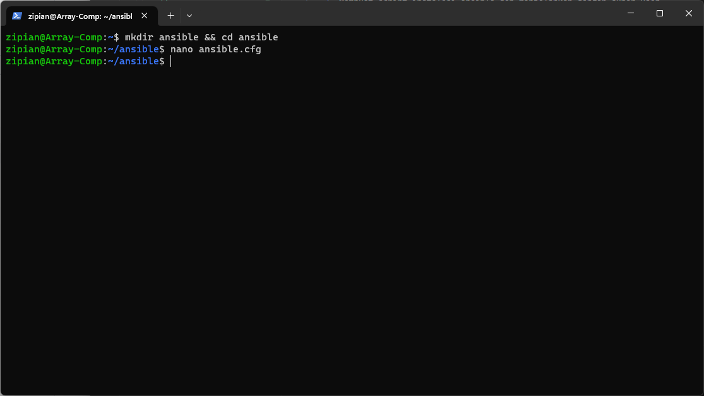
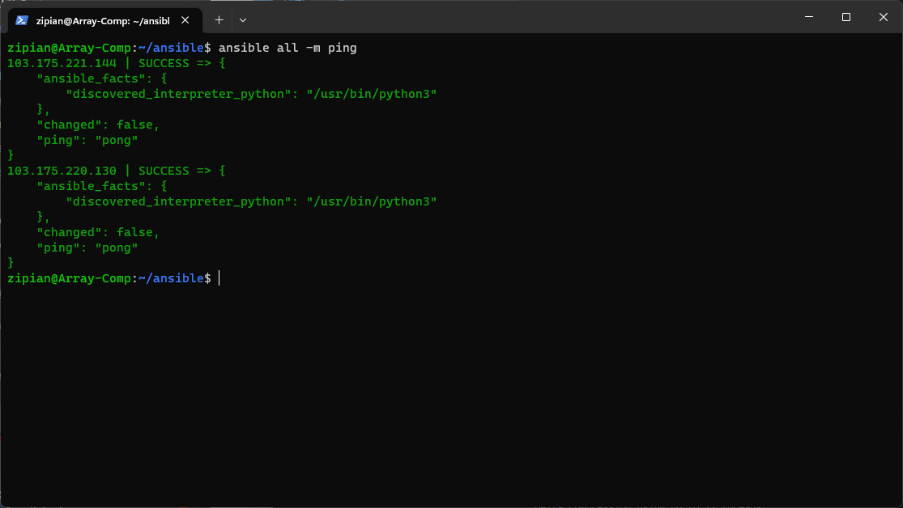

# Ansible

1. Buka wsl menggunakan cmd masuk ke direktori home
```bash
wsl
cd ~
``` 


2. Membuat script instalasi ansible dan menjalankan dengan super user
```bash
apt update
apt install software-properties-common -y
add-apt-repository --yes --update ppa:ansible/ansible
apt install ansible -y
``` 


3. Membuat direktori ansible dan masuk ke direktori tersebut 
```bash
mkdir ansible && cd ansible
``` 


4. Membuat file ansible.cfg
```bash
[defaults]

# target to the inventory file
inventory = Inventory

# used for ansible to access the server with ssh-key
private_key_file = /home/zipian/.ssh/id_rsa

# skipping known_hosts checking
host_key_checking = False

# python intrepreter
interpreter_python = auto_silent
``` 


5. Membuat file Inventory
```bash
[appserver]
103.175.220.130

[gateway]
103.175.221.144

[all:vars]
ansible_connection=ssh
ansible_user=alfiansy
``` 


6. Lakukan percobaan apakah file yang kita buat tadi sudah benar
```bash
ansible all -m ping
``` 


7. Buat ansible-playbook untuk appserver
```bash
- become: true
  gather_facts: false
  hosts: appserver
  tasks:
     ############### DOCKER ####################
   - name: "Install docker - Prerequisites"
     apt:
       update_cache: true
       name:
         - apt-transport-https
         - software-properties-common
         - ca-certificates
         - curl
         - gnupg
         - lsb-release
         - python3-pip
   - name: "Install docker - GPG key"
     apt_key:
       url: "https://download.docker.com/linux/ubuntu/gpg"
   - name: "Install docker - Add repository"
     apt_repository:
       repo: "deb https://download.docker.com/linux/ubuntu focal stable"
       state: present
   - name: "Install docker - Engine"
     apt:
       update_cache: true
       name:
         - docker-ce
         - docker-ce-cli
         - containerd.io
         - docker-buildx-plugin
         - docker-compose-plugin
   - name: "Install docker - SDK for Python"
     pip:
       name: docker

     ############### NODE EXPORTER ####################
   - name: "Install node exporter - Download binary"
     get_url:
       url: "https://github.com/prometheus/node_exporter/releases/download/v{{node_exporter_version}}/node_exporter-{{node_exporter_version}}.linux-amd64.tar.gz"
       dest: "/tmp/node_exporter-{{node_exporter_version}}.linux-amd64.tar.gz"
   - name: "Install node exporter - Extract binary"
     ansible.builtin.unarchive:
       src: "/tmp/node_exporter-{{node_exporter_version}}.linux-amd64.tar.gz"
       dest: "/opt/"
       remote_src: yes
   - name: "Install node exporter - Setup service"
     ansible.builtin.copy:
       content: |
         [Unit]
         Description=Node Exporter
         After=network.target

         [Service]
         ExecStart=/opt/node_exporter-{{node_exporter_version}}.linux-amd64/node_exporter
         Restart=always

         [Install]
         WantedBy=multi-user.target
       dest: /etc/systemd/system/node_exporter.service
   - name: "Install node exporter - Startup service"
     ansible.builtin.service:
       name: node_exporter
       enabled: true
       state: started

     ############### CREATE USERS ####################
   - name: "Create user"
     ansible.builtin.user:
       name: "{{username}}"
       password: "{{password}}"
       groups: sudo,docker
       append: true
       state: present
       system: true
       home: /home/{{username}}
   - name: "Add ssh key"
     ansible.posix.authorized_key:
       user: alf
       state: present
       key: "{{ lookup('file', ssh_public_key) }}"

     ############### GRAFANA & PROMETHEUS ON TOP DOCKER ####################
   - name: "Pull Grafana image"
     docker_image:
       name: grafana/grafana
       tag: latest
       source: pull
   - name: "Run Grafana container"
     docker_container:
       name: grafana
       image: grafana/grafana:latest
       ports:
         - 3000:3000
       state: started
   - name: "Pull Prometheus image"
     docker_image:
       name: bitnami/prometheus
       tag: latest
       source: pull
   - name: "Run Prometheus container"
     docker_container:
       name: prometheus
       image: bitnami/prometheus:latest
       ports:
         - 9090:9090
       state: started

  vars:
   - username: "alf"
   - password: "$5$OspKSjr7YtFP5l$w9o0dojNfRYppSsrSfg2LSOpYuQti.EDjmrankoWpO0"
   - ssh_public_key: "/mnt/c/Users/zVersion/.ssh/id_rsa.pub"
   - node_exporter_version: "1.6.1"
``` 

8. Lalu jalankan ansible playbook nya
```bash
ansible-playbook appserver.yml
``` 


9. Cek ke appserver apakah semua yang kita push via ansible sudah berjalan


10. Kemudian buat ansible-playbook untuk gateway
```bash
- become: true
  gather_facts: false
  hosts: gateway
  tasks:
     ############### NGINX ####################
   - name: "Install nginx"
     apt:
       update_cache: true
       name: nginx
       state: latest
   - name: "Config ngix"
     ansible.builtin.copy:
       content: |
         server {
          server_name al.studentdumbways.my.id;

          location / {
           proxy_pass http://127.0.0.1:3000;
          }
         }
       dest: /etc/nginx/sites-enabled/wayhub.conf
   - name: "Restart nginx"
     ansible.builtin.service:
       name: nginx
       enabled: true
       state: restarted

     ############### DOCKER ####################
   - name: "Install docker - Prerequisites"
     apt:
       update_cache: true
       name:
         - apt-transport-https
         - software-properties-common
         - ca-certificates
         - curl
         - gnupg
         - lsb-release
         - python3-pip
   - name: "Install docker - GPG key"
     apt_key:
       url: "https://download.docker.com/linux/ubuntu/gpg"
   - name: "Install docker - Add repository"
     apt_repository:
       repo: "deb https://download.docker.com/linux/ubuntu focal stable"
       state: present
   - name: "Install docker - Engine"
     apt:
       update_cache: true
       name:
         - docker-ce
         - docker-ce-cli
         - containerd.io
         - docker-buildx-plugin
         - docker-compose-plugin
   - name: "Install docker - SDK for Python"
     pip:
       name:
         - docker
         - docker-compose
       
     ############### CREATE USERS ####################
   - name: "Create user"
     ansible.builtin.user:
       name: "{{username}}"
       password: "{{password}}"
       groups: sudo,docker
       append: true
       state: present
       system: true
       home: /home/{{username}}
   - name: "Add ssh key"
     ansible.posix.authorized_key:
       user: alf
       state: present
       key: "{{ lookup('file', ssh_public_key) }}"

     ############### DOCKER COMPOSE ####################
   - name: "Docker compose"
     community.docker.docker_compose:
       project_name: wayshub
       definition:
         version: '2'
         services:
           web:
             image: zipian/wayshub-fe
             ports:
               - 3000:3000
     register: output

  vars:
   - username: "alf"
   - password: "$5$OspKSjr7YtFP5l$w9o0dojNfRYppSsrSfg2LSOpYuQti.EDjmrankoWpO0"
   - ssh_public_key: "/mnt/c/Users/zVersion/.ssh/id_rsa.pub"
``` 

11. Cek ke gateway-server apakah semua yang kita push via ansible sudah berjalan


[**Back**](../../README.md)