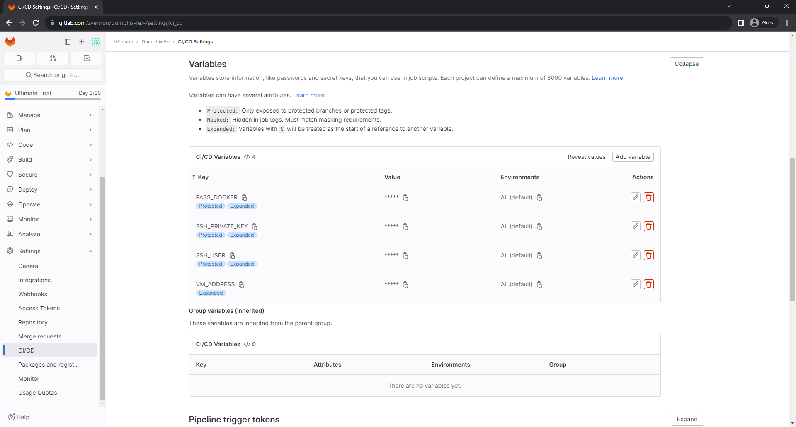
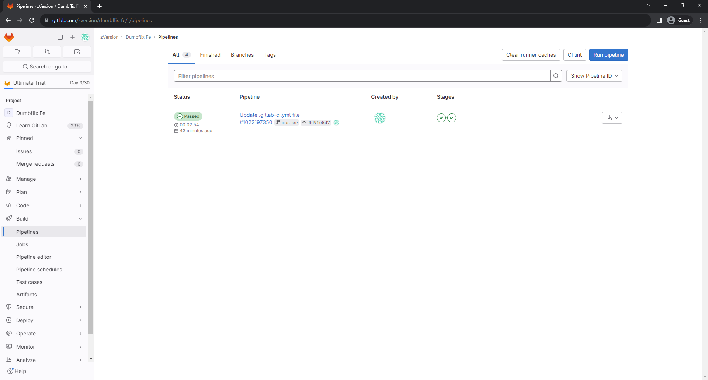
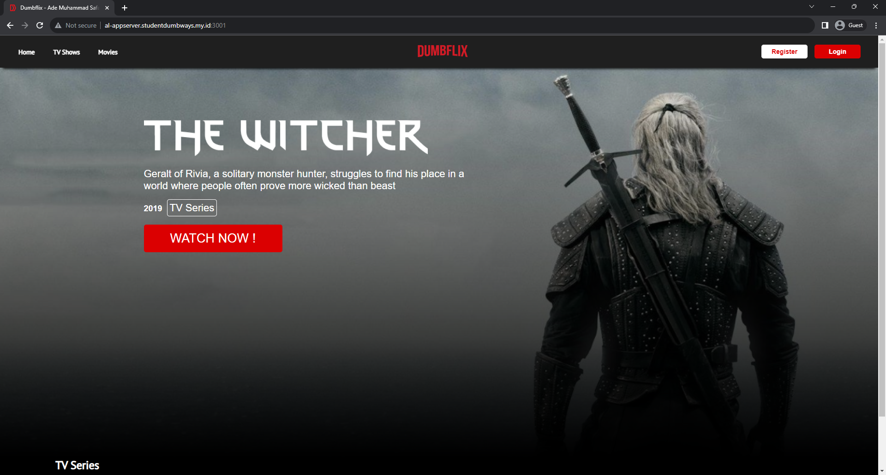

# CI/CD

## 1. Jenkins

1. Login ke appserver terlebih dahulu
```bash
ssh username@ip
``` 

2. Download dan jalankan jenkins pada docker
```bash
docker run -d --name jenkins -p 8080:8080 -p 8081:5000 --restart=on-failure jenkins/jenkins:lts-jdk11
``` 


3. Lihat password instalasinya
```bash
docker exec jenkins cat /var/jenkins_home/secrets/initialAdminPassword
``` 


4. Buka website jenkins nya dan paste password instalasinya
```bash
https://jenkins.creapy.studentdumbways.my.id/
``` 


5. Pilih *Select plugins to install*


6. Pastikan centang _SSH Build Agents_ pada *Distributed Builds* dan _SSH Agent_ pada *Build Features*


7. Tunggu hingga proses instalasi selesai


8. Masukan data admin user


9. Lalu set base url jenkins nya


10. Jenkins siap digunakan


11. Import ssh private key terlebih dahulu
```bash
Dashboard -> Manage Jenkins -> Credentials -> System -> Global credentials (unrestricted) -> Add credentials
``` 


12. Isikan data berikut
- Kind: SSH Username with pricate key
- ID: appserver (bisa di isi nama dari servernya)
- Username: alfiansy (username pada server)
- Ceklis *Treat username as secret* (agar username tidak bisa dilihat)
- Private Key: Paste private key


13. Ganti Git Host Key Verif ke *Accept first conn*


14. Clone repo private kita dan buat jenkinsfile
```bash
git clone git@github.com:alfiansy7/wayshub-frontend.git
cd wayshub-frontend
nano Jenkinsfile
``` 
```bash
def cred = 'appserver'
def server = 'alfiansy@al-appserver.studentdumbways.my.id'
def dir = '~/wayshub-frontend'
def img = 'zipian/wayshub-fe'
def branch = 'main'

pipeline{
    agent any
    stages{
        stage('docker compose down and pulling repo'){
            steps{
                sshagent([cred]){
                    sh """ssh -o StrictHostKeyChecking=no ${server} << EOF
                    cd ~
                    docker compose down
                    cd ${dir}
                    git pull origin ${branch}
                    exit
                    EOF"""
                }
            }
        }
        stage('building docker image'){
            steps{
                sshagent([cred]){
                    sh """ssh -o StrictHostKeyChecking=no ${server} << EOF
                    cd ${dir}
                    docker build -t ${img} .
                    exit
                    EOF"""
                }
            }
        }
        stage('docker compose up'){
            steps{
                sshagent([cred]){
                    sh """ssh -o StrictHostKeyChecking=no ${server} << EOF
                    cd ${dir}
                    docker compose up -d
                    exit
                    EOF"""
                }
            }
        }
        stage('push docker hub'){
            steps{
                sshagent([cred]){
                     sh """ssh -o StrictHostKeyChecking=no ${server} << EOF
                    cd ${dir}
                    docker image push ${img}:latest
                    exit
                    EOF"""
                }
            }
        }
        stage('push notification'){
            steps{
                sshagent([cred]){
                    discordSend description: "wayshub-frontend:" + BUILD_ID, link: BUILD_URL, result: currentBuild.currentResult, scmWebUrl: '', title: 'Wayshub-Frontend', webhookURL: 'https://discord.com/api/webhooks/1157983493461114980/ACYgAga_6hQ-z7VVdNXoo--jOcUNknQWkaRcbm3hd1XZx72jY04hzoZZdZ0-YCAgcolU'
                }
            }
        }
    }
}
``` 


15. Push Jenkinsfile
```bash
git add .
git commit -m "add Jenkinsfile"
git push
``` 


16. Buat job baru 
- name: wayshub-fe
- categori: pipeline
- Ceklis *GitHub hook trigger*
- Gunakan *Pipeline script from SCM*
- Repo url: isikan ssh git
- Credentials: isikan server kita
- Branch: main


17. Tambahkan webhook pada github


18. Lakukan percobaan dengan menambah file pada repo dan push ulang


## 2. GitLabCI

19. Buat variable pada repositori yang ingin di gunakan
```bash
Settings -> CI/CD -> Variables
``` 


20. Membuat file gitlab ci pada *Pipeline Editor*
```bash
stages:
  - build
  - deploy
  
build-image:
  stage: build
  image: docker:1.11
  services:
    - docker:dind
  script:
    - export DOCKER_HOST=tcp://docker:2375/
    - docker version
    - docker build -t zipian/dumbflix-ci:latest .
    # push only for tags
      # - "[[ -z $CI_BUILD_TAG ]] && exit 0"
      # - docker tag $CI_REGISTRY_IMAGE:latest $CI_REGISTRY_IMAGE:$CI_BUILD_TAG
    - docker login -u zipian -p $PASS_DOCKER
    - docker push zipian/dumbflix-ci:latest

deploy-app:
  stage: deploy
  before_script:
  - 'command -v ssh-agent >/dev/null || ( apk add --update openssh )' 
  - eval $(ssh-agent -s)
  - echo "$SSH_PRIVATE_KEY" | tr -d '\r' | ssh-add -
  - mkdir -p ~/.ssh
  - chmod 700 ~/.ssh
  - ssh-keyscan $VM_ADDRESS >> ~/.ssh/known_hosts
  - chmod 644 ~/.ssh/known_hosts
  script:
  - ssh $SSH_USER@$VM_ADDRESS "cd ~/dumbflix-ci/ && docker compose up -d"
``` 


21. Membuat file docker compose ymal pada appserver
```bash
mkdir dumbflix-ci
cd dumbflix-ci/
nano docker-compose.yml
``` 

```bash
version: "3.8"
services:
  dumbflix:
    image: zipian/dumbflix-ci
    container_name: dumbflix-ci
    stdin_open: true
    ports:
      - 3001:3000
``` 

22. Lakukan push dan lihat job yang berjalan
```bash
Build -> Jobs
``` 


23. Lakukan pengecekan 



[**Back**](../../README.md)