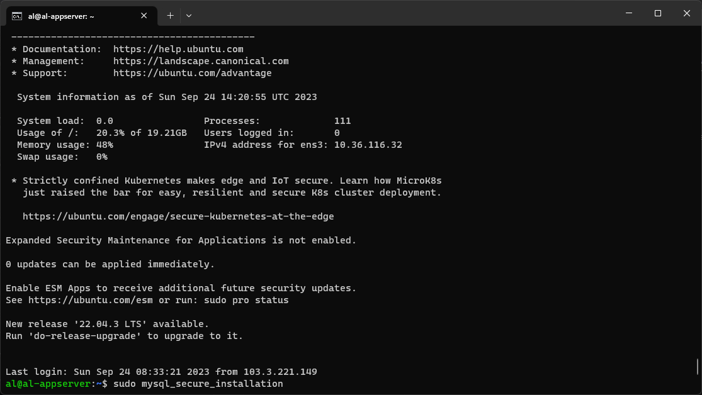
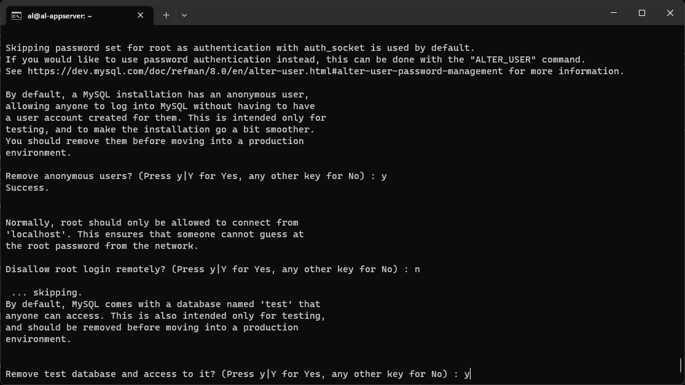

## Deploy Wayshub - Appserver

1. Login terlebih dahulu menggunakan terminal
```bash
ssh al@103.189.234.111
``` 

2. Lalu lakukan update packages
```bash
sudo apt update
``` 


3. Kemudian instal Node Version Manager
```bash
curl -o- https://raw.githubusercontent.com/nvm-sh/nvm/v0.39.0/install.sh | bash
exec bash
``` 


4. Lalu instal node versi 14
```bash
nvm install 14
``` 


5. Clone repo wayshub fe
```bash
git clone https://github.com/dumbwaysdev/wayshub-frontend
``` 


6. Masuk ke direktori wayshub fe dan instal dependensi nya
```bash
cd wayshub-frontend/
npm install
``` 


7. Ganti BaseURL pada api.js
```bash
nano src/config/api.js
``` 
menjadi
```bash
api.<nama>.studentdumbways.my.id
``` 


8. Instal pm2 secara global
```bash
npm install -g pm2
``` 


9. Buat pm2 ecosystem
```bash
pm2 init simple
``` 


10. Edit ecosystem.config.js menjadi seperti ini
```bash
nano ecosystem.config.js
``` 


11. Lalu jalankan Wayshub FE dengan PM2
```bash
pm2 start
``` 


12. Clone Wayshub BE pada direktori home
```bash
cd ~
git clone https://github.com/dumbwaysdev/wayshub-backend
``` 


13. Masuk ke direktori Wayshub BE dan instal
```bash
cd wayshub-backend/
npm install
``` 


14. Edit config.json sesuaikan dengan database yang akan kita buat
```bash
nano config/config.json
``` 


15. Buat ecosystem PM2
```bash
pm2 init simple
``` 


16. Jalankan wayshub BE dengan PM2
```bash
pm2 start
``` 


17. Instal MySQL Server
```bash
sudo apt install mysql-server -y
``` 


18. Lalu instal mysql secure installation
```bash
sudo mysql_secure_installation 
``` 


19. Menerapkan password validasi [Y]


20. Menerapkan low level password [0]


21. Menghapus anonymous users [Y]


22. Menerapkan remote db [N]


23. Menghapus db test [Y]


24. Reload privilege [Y]


25. Login ke mysql sebagai root
```bash
sudo mysql -u root
``` 


26. Membuat password root 
```bash
ALTER USER 'root'@'localhost' IDENTIFIED WITH mysql_native_password by 'Bl4ckP1nk23!';
``` 


27. Membuat user baru dan dapat melakukan remote
```bash
CREATE USER 'alf'@'%' IDENTIFIED WITH mysql_native_password by 'Bl4ckP1nk23@';
``` 


28. Menambahkan hak akses user alf ke semua db dan tabel
```bash
GRANT ALL PRIVILEGES ON *.* TO 'alf'@'%';
``` 


29. Lalu instal Sequelize di global
```bash
npm install -g sequelize-cli
``` 


30. Masuk ke direktori Wayshub BE dan membuat db dengan bantuan Sequelize
```bash
cd wayshub-backend/
sequelize db:create
``` 


31. Kemudian migrate table Wayshub BE
```bash
sequelize db:migrate
``` 


32. Lalu restart PM2 Wayshub FE dan BE
```bash
pm2 start
cd ../wayshub-frontend/
pm2 start
``` 


[**Back**](../../README.md)
