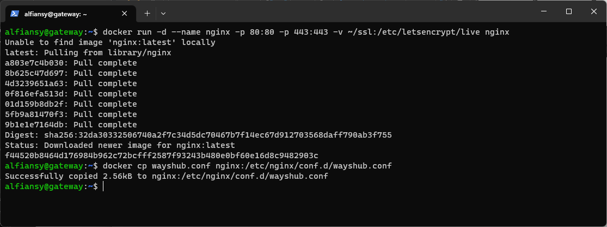
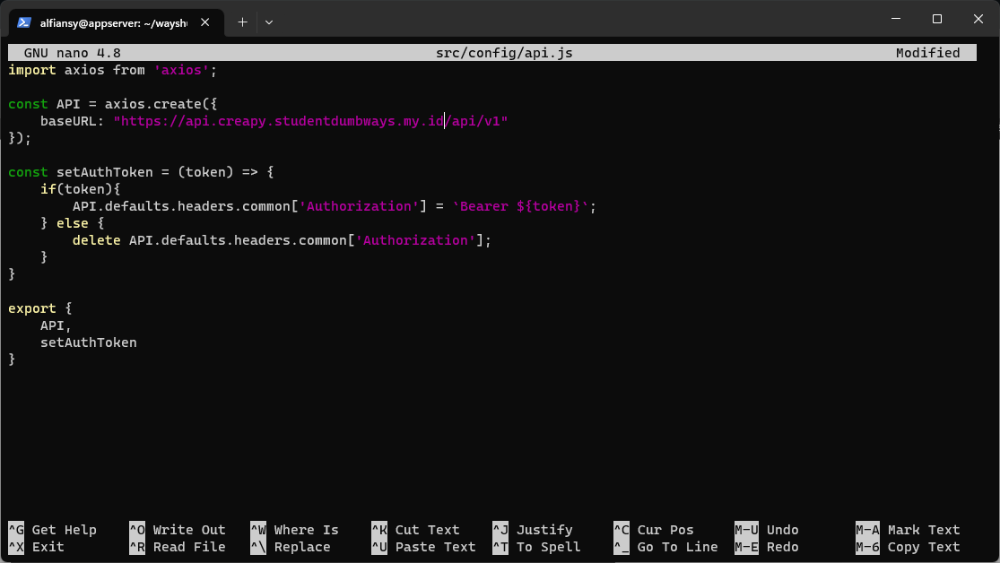

# Docker

## 1. Gateway Server

1. Login ke gateway server terlebih dahulu
```bash
ssh username@ip
``` 

2. Lakukan instalasi docker menggunakan script bash berikut
```bash
sudo sh install-docker.sh
``` 


3. Install snapd dan certbot
```bash
sudo apt install snapd -y
sudo snap install --classic certbot -y
sudo ln -s /snap/bin/certbot /usr/bin/certbot
``` 


4. Membuat sertifikat domain creapy dan api.creapy
```bash
sudo certbot certonly --standalone -d creapy.studentdumbways.my.id 
sudo certbot certonly --standalone -d api.creapy.studentdumbways.my.id
``` 


5. Membuat config wayshub untuk nginx
```bash
nano wayshub.conf
``` 


6. Membuat direktori ssl sebagai volumes di docker
```bash
mkdir -p ssl/creapy.studentdumbways.my.id
mkdir -p ssl/api.creapy.studentdumbways.my.id
``` 


7. Lalu cek symlink file sertifikatnya
```bash
sudo ls -l /etc/letsencrypt/live/creapy.studentdumbways.my.id/
sudo ls -l /etc/letsencrypt/live/api.creapy.studentdumbways.my.id/
``` 


8. Copy file certifikatnya ke direktori ssl
```bash
sudo cp /etc/letsencrypt/archive/creapy.studentdumbways.my.id/fullchain1.pem ssl/creapy.studentdumbways.my.id/fullchain.pem
sudo cp /etc/letsencrypt/archive/creapy.studentdumbways.my.id/privkey1.pem ssl/creapy.studentdumbways.my.id/privkey.pem
sudo cp /etc/letsencrypt/archive/api.creapy.studentdumbways.my.id/fullchain1.pem ssl/api.creapy.studentdumbways.my.id/fullchain.pem
sudo cp /etc/letsencrypt/archive/api.creapy.studentdumbways.my.id/privkey1.pem ssl/api.creapy.studentdumbways.my.id/privkey.pem
``` 


9. Download, buat volums dan jalankan nginx di docker
```bash
docker run -d --name nginx -p 80:80 -p 443:443 -v ~/ssl:/etc/letsencrypt/live nginx
``` 


10. Copy config yang sudah kita buat tadi ke nginx yang ada di docker
```bash
docker cp wayshub.conf nginx:/etc/nginx/conf.d/wayshub.conf
``` 


11. Restart nginx
```bash
docker restart nginx
``` 


12. Cek https://creapy.studentdumbways.my.id/


## 2. App Server

13. Login ke appserver menggunakan ssh
```bash
ssh username@ip
``` 

14. Lakukan instalasi docker menggunakan script bash berikut
```bash
sudo sh install-docker.sh
``` 


15. Clone wayshub frontend dan backend
```bash
git clone https://github.com/dumbwaysdev/wayshub-frontend.git
git clone https://github.com/dumbwaysdev/wayshub-backend.git
``` 


16. Masuk ke direktori wayshub-frontend dan membuat Dockerfile
```bash
cd wayshub-frontend/
nano Dockerfile
``` 


17. Edit api.js pada wayshub-frontend
```bash
nano src/config/api.js
``` 


18. Buat image docker dengan nama wayshub-fe 
```bash
docker build -t zipian/wayshub-fe .
``` 


19. Masuk ke direktori wayshub-backend dan membuat Dockerfile
```bash
cd ~/wayshub-backend/
nano Dockerfile
``` 


20. Edit config.json pada wayshub-backend
```bash
nano config/config.json
``` 


21. Pull mysql untuk kebutuhan build wayshub-be
```bash
docker run -d --name mysql-temp -p 3306:3306 -e MYSQL_ROOT_PASSWORD=Jayamas mysql
``` 


22. Buat image docker dengan nama wayshub-be 
```bash
docker build -t zipian/wayshub-be .
``` 


23. Cek images yg sudah dibuat
```bash
docker images
``` 


24. Login ke docker hub
```bash
docker login 
``` 


25. Push image wayshub-fe dan wayshub-be
```bash
docker push zipian/wayshub-fe
docker push zipian/wayshub-be
``` 


26. Kembali ke home direktori dan membuat docker compose
```bash
cd ~
nano docker-compose.yml
``` 


27. Lalu jalankan docker compose
```bash
docker compose up -d
``` 


28. Buka website dan lalukan registrasi
```bash
https://creapy.studentdumbways.my.id/register
``` 

