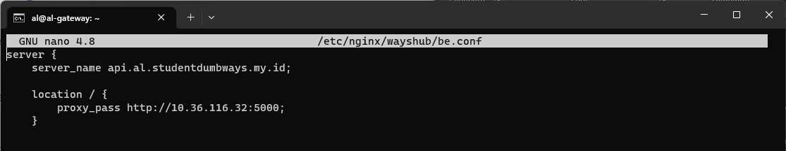
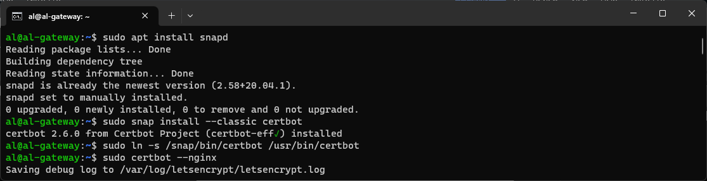

## Gateway NGINX

1. Login terlebih dahulu menggunakan terminal
```bash
ssh al@103.250.11.33
``` 

2. Lalu lakukan update packages
```bash
sudo apt update
``` 


3. Kemudian instal nginx
```bash
sudo apt install nginx -y
``` 


4. Membuat direktori config pada nginx
```bash
sudo mkdir /etc/nginx/wayshub
``` 


5. Buat fe.conf pada direktori wayshub-nginx
```bash
sudo nano /etc/nginx/wayshub/fe.conf
``` 


6. Buat juga be.conf pada direktori wayshub-nginx
```bash
sudo nano /etc/nginx/wayshub/be.conf
``` 


7. Tambahkan direktori wayshub pada nginx.conf
```bash
sudo nano /etc/nginx/nginx.conf
``` 


8. Restart nginx
```bash
sudo systemctl restart nginx
``` 


9. Instal snapd
```bash
sudo apt install snapd
``` 


10. Instal certbot menggunakan snapd
```bash
sudo snap install --classic certbot
``` 


11. Buat symlink certbot
```bash
sudo ln -s /snap/bin/certbot /usr/bin/certbot
``` 


12. Instal cerbot di nginx
```bash
sudo certbot --nginx
``` 


13. Masukan email


14. Setujui ToS [Y]


15. Subscribe newsletter [Y]


16. Instal ke 2 domain dengan cara kosongkan lalu enter


17. Membuat buat pembaruan otomatis
```bash
sudo certbot renew --dry-run
``` 


18. Lakukan percobaan dengan menggunakan https
