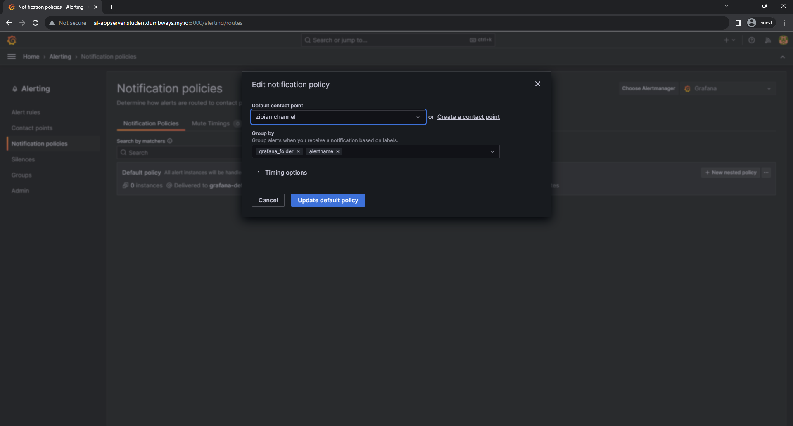

# Monitoring

1. Buka wsl dan membuat script ansible-playbook berikut
```bash
- become: true
  gather_facts: false
  hosts: all
  tasks:
     ############### DOCKER ####################
   - name: "Install docker - Prerequisites"
     apt:
       update_cache: true
       name:
         - apt-transport-https
         - software-properties-common
         - ca-certificates
         - curl
         - gnupg
         - lsb-release
         - python3-pip
   - name: "Install docker - GPG key"
     apt_key:
       url: "https://download.docker.com/linux/ubuntu/gpg"
   - name: "Install docker - Add repository"
     apt_repository:
       repo: "deb https://download.docker.com/linux/ubuntu focal stable"
       state: present
   - name: "Install docker - Engine"
     apt:
       update_cache: true
       name:
         - docker-ce
         - docker-ce-cli
         - containerd.io
         - docker-buildx-plugin
         - docker-compose-plugin
   - name: "Install docker - SDK for Python"
     pip:
       name: docker

     ############### NODE EXPORTER ####################
   - name: "Pull Node-Exporter image"
     docker_image:
       name: bitnami/node-exporter
       tag: latest
       source: pull
   - name: "Run Node-Exporter container"
     docker_container:
       name: node-exporter
       image: bitnami/node-exporter:latest
       ports:
         - 9100:9100
       state: started

     ############### CREATE USERS ####################
   - name: "Create user"
     ansible.builtin.user:
       name: "{{username}}"
       password: "{{password}}"
       groups: sudo,docker
       append: true
       state: present
       system: true
       home: /home/{{username}}
   - name: "Add ssh key"
     ansible.posix.authorized_key:
       user: alf
       state: present
       key: "{{ lookup('file', ssh_public_key) }}"

  vars:
   - username: "alf"
   - password: "$5$OspKSjr7YtFP5l$w9o0dojNfRYppSsrSfg2LSOpYuQti.EDjmrankoWpO0"
   - ssh_public_key: "/mnt/c/Users/zVersion/.ssh/id_rsa.pub"

- become: true
  gather_facts: false
  hosts: appserver
  tasks:
     ############### CONFIG PROMETHEUS  ####################
   - name: "Make directory prometheus"
     ansible.builtin.file:
       path: /home/alf/prometheus
       state: directory
   - name: "Make directory grafana"
     ansible.builtin.file:
       path: /home/alf/grafana
       state: directory
       mode: "0775"
   - name: "Config Prometheus"
     ansible.builtin.copy:
       content: |
         global:

         scrape_configs:
          - job_name: 'al-server'
            scrape_interval: 5s
            static_configs:
              - targets: [
                  "103.175.220.130:9100", 
                  "103.175.221.144:9100",
                  ]
       dest: /home/alf/prometheus/prometheus.yml

     ############### PROMETHEUS & GRAFANA ####################
   - name: "Pull Grafana image"
     docker_image:
       name: grafana/grafana
       tag: latest
       source: pull
   - name: "Run Grafana container"
     docker_container:
       name: grafana
       image: grafana/grafana:latest
       ports:
         - 3000:3000
       volumes:
         - /home/alf/grafana:/var/lib/grafana
       state: started
   - name: "Pull Prometheus image"
     docker_image:
       name: bitnami/prometheus
       tag: latest
       source: pull
   - name: "Run Prometheus container"
     docker_container:
       name: prometheus
       image: bitnami/prometheus:latest
       ports:
         - 9090:9090
       volumes:
         - /home/alf/prometheus/prometheus.yml:/opt/bitnami/prometheus/conf/prometheus.yml
       state: started
``` 


2. Membuka grafana
```bash
http://al-appserver.studentdumbways.my.id:3000/
``` 


3. Membuat data source *Home -> Connections -> Data sources -> Prometheus*
- Prometheus server URL: http://al-appserver.studentdumbways.my.id:9090
- Scrape interval: 10s
- Query timeout: 60s
- Default editor: Code
- Prometheus type: Prometheus


4. Membuat variable *Home -> Dashboard -> Dumbways -> Variables*
- Variable type: Query
- name: server
- Label: Server
- Query type: Label values
- Label *: instance


5. Kemudian klik *Build a dashboard* -> *Add visualization*


6. Membuat *CPU Usage*
```bash
100 - (avg(irate(node_cpu_seconds_total{mode="idle", instance=~"$server"}[5m])) * 100)
``` 


7. Membuat *Memory Usage*
```bash
100 - ((sum by (instance) (node_memory_MemFree_bytes{instance=~"$server"} + node_memory_Cached_bytes{instance=~"$server"} + node_memory_Buffers_bytes{instance=~"$server"})) / (sum by (instance) (node_memory_MemTotal_bytes{instance=~"$server"})) * 100)
``` 


8. Membuat *Disk Usage*
```bash
sum by (instance) (node_filesystem_free_bytes{instance=~"$server"} / node_filesystem_size_bytes{instance=~"$server"}) * 100
``` 


9. Dashboard yang sudah kita buat


10. Membuat Alerting *Home -> Alerting -> Contact points*


11. Mengganti notification policy ke discord


12. Menambah alert rule *CPU Usage over 20%*
```bash
100 - (avg by(instance) (irate(node_cpu_seconds_total{mode="idle", job="al-server"}[5m])) * 100 ) 
``` 
- Threshold: 20
- Folder: alert
- Evaluation group: cpu
- Pending period: 5m
- Alert state if no data or all values are null: alerting


13. Menambah alert rule *RAM Usage over 75%*
```bash
100 - ((sum by (instance) (node_memory_MemFree_bytes{job="al-server"} + node_memory_Cached_bytes{job="al-server"} + node_memory_Buffers_bytes{job="al-server"})) / (sum by (instance) (node_memory_MemTotal_bytes{job="al-server"})) * 100)
``` 
- Threshold: 75
- Folder: alert
- Evaluation group: RAM
- Pending period: 5m
- Alert state if no data or all values are null: alerting


[**Back**](../../README.md)