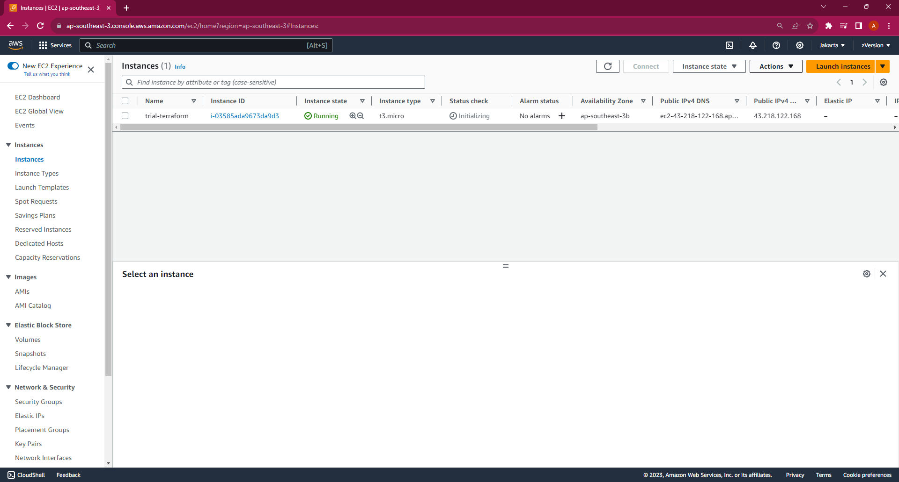

# Terraform

## Docker

1. Login terlebih dahulu menggunakan terminal
```bash
ssh appserver
``` 


2. Melakukan instalasi terraform menggunakan script berikut
```bash
wget -O- https://apt.releases.hashicorp.com/gpg | gpg --dearmor -o /usr/share/keyrings/hashicorp-archive-keyring.gpg
echo "deb [signed-by=/usr/share/keyrings/hashicorp-archive-keyring.gpg] https://apt.releases.hashicorp.com $(lsb_release -cs) main" | tee /etc/apt/sources.list.d/hashicorp.list
apt update && apt install terraform -y
``` 


3. Membuat direktori terraform dan masuk ke direktori tersebut
```bash
mkdir terraform && cd terraform
``` 


4. Mebuat file main.tf dengan script berikut
```bash
terraform {
  required_providers {
    docker = {
      source  = "kreuzwerker/docker"
      version = "~> 3.0.1"
    }
  }
}

provider "docker" {}

resource "docker_image" "wayshub-fe" {
  name         = "zipian/wayshub-fe:latest"
  keep_locally = false
}

resource "docker_container" "wayshub-fe" {
  image = docker_image.wayshub-fe.image_id
  name  = "wayshub-fe"

  ports {
    internal = 3000
    external = 80
  }
}
``` 


5. Inisialisasi direktori tersebut
```bash
terraform init
``` 


6. Lakukan pengecekan detail apa saja yang akan dijalankan oleh terraform
```bash
terraform plan
``` 


7. Jalankan wayshub-fe
```bash
terraform apply
``` 


8. Cek apakah container tersebut berhasil dijalankan
```bash
docker ps -a
``` 


9. Cek menggunakan browser
```bash
http://103.175.220.130
``` 


10. Lalu untuk menghancurkan resource nya cukup dengan code berikut karna sudah kita set sebelumnya untuk keep_locally = false
```bash
terraform destroy
``` 


## AWS

11. Install unzip dan AWS CLI
```bash
sudo apt install unzip -y
curl "https://awscli.amazonaws.com/awscli-exe-linux-x86_64.zip" -o "awscliv2.zip"
unzip awscliv2.zip
sudo ./aws/install
``` 


12. Config aws cli dengan data yg di generate dari IAM


13. membuat direktori aws dan file main.tf
```bash
terraform {
  required_providers {
    aws = {
      source  = "hashicorp/aws"
      version = "~> 5.0"
    }
  }
}

# Configure the AWS Provider
provider "aws" {
  region = "ap-southeast-3"
  #Asia Pacific (Jakarta) ap-southeast-3
}

resource "aws_instance" "al-server" {
  ami = "ami-07a920f17020024b9"
  #Amazon Linux 2023 AMI 2023.2.20231002.0 x86_64 HVM kernel-6.1
  instance_type = "t3.micro"
  #2vCPU 1GB Memory (Free tier)

  tags = {
    Name = "trial-terraform"
    #nama ec2
  }
}
``` 

14. Inisialisasi direktori tersebut
```bash
terraform init
``` 


15. Lakukan pengecekan detail apa saja yang akan dijalankan oleh terraform
```bash
terraform plan
``` 


16. Buat ec2 dengan menjalankan terraform
```bash
terraform apply
``` 


17. Cek di aws


[**Back**](../../README.md)